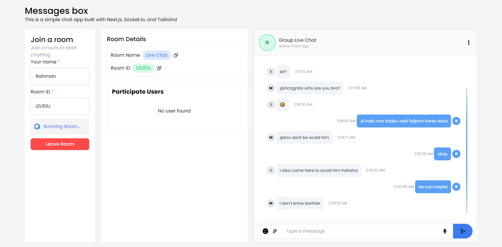

# Message App by socket.io with nextJS & typescript support.

## Getting Started

This is messaging app with socket.io, nextJS, redux & redux toolkit and typescript support.
here is the link of the app [Message App](https://message-app-socketio.vercel.app/)

## Using Technologies

- [NextJS](https://nextjs.org/)
- [Redux](https://redux.js.org/)
- [Redux Toolkit](https://redux-toolkit.js.org/)
- [Typescript](https://www.typescriptlang.org/)
- [Socket.io](https://socket.io/)
- [Material UI](https://material-ui.com/)
- [React Hook Form](https://react-hook-form.com/)
- [React Router](https://reactrouter.com/)
- [React Icons](https://react-icons.github.io/react-icons/)
- [React Toastify](https://fkhadra.github.io/react-toastify/introduction)

## Required Features

- [x] User can register with username, email and password.
- [x] User can login with email and password.
- [x] User can see all the users.
- [x] User can see all the messages.
- [x] User can send message to other users.
- [x] User can see all the messages with other users.

> Note: This project is still in development. I will add more features in the future.

## How to run this project

First, run the development server:

```bash
npm run dev
# or
yarn dev

```

## Preview Image in App



> Thanks for visiting my project. If you like this project, please give a star.
